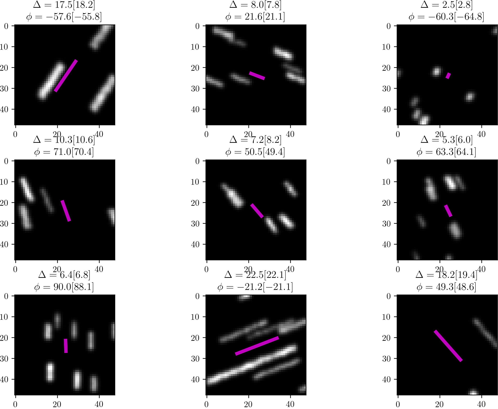
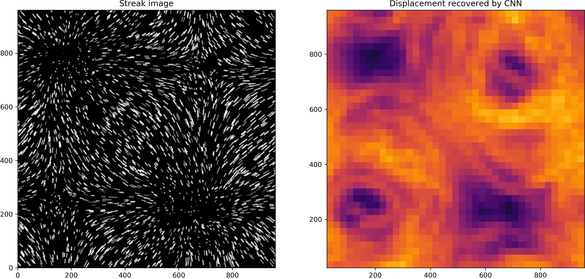

## Introduction
We use Ensemble Convolutional Neural Networks to analyse turbulent fluid flows with streak images. The technique is applicable when conventional Particle Image Velocimetry (PIV) becomes inaccurate or fails.

As an example, image below shows a number of small images of streaks with corresponding true and predicted (in brackets) streak length (\Delta) in pixels and their azimuth (\phi) in degrees. Magenta line draws a predicted streak.

This can be applied to much more complex situations to deduce the kinetic energy and study directionality of turbulent flows. Below is an example of a convenctive turbulent flow streak image and corresponding recovery of the displacement by a CNN ensemble

## Referencing 
If you use this work or ideas presented here, please cite:

> Particle streak velocimetry using Ensemble Convolutional Neural Networks, A. V. Grayver and J. Noir, submitted

Feel free to contact us if you have further ideas on the presented topic.

## Repository content

All relevant functionality is contained in Jupyter Notebooks. Specifically:

* **generate_CNN_dataset.ipynb**

   Generates training and validation sets and saves them in a compressed HDF5 file.

* **train_CNN_pytorch.ipynb**

   Trains an ensemble of CNNs and saves it along with all relevant statistics.

* **test_CNN_on_validation_set_pytorch.ipynb**

   Check performance and accuracy of the trained ensemble on the validation set.
   
* **test_CNN_on_DNS_pytorch.ipynb**

   Validate approach on a numerical simulation of a convective turbulent flow.
   
* **apply_CNN_to_experiment_image_pytorch.ipynb**

   Apply the CNNs to quantify a longitutidal libration flow experiment. 
   
## Dependencies

* Python > 3.6 with JupyterLab
* PyTorch > 1.0 
* Matplotlib > 3.0
* SciPy > 1.2
* Scikit-Learn > 0.2
* h5py > 2.5
* skimage > 0.15
